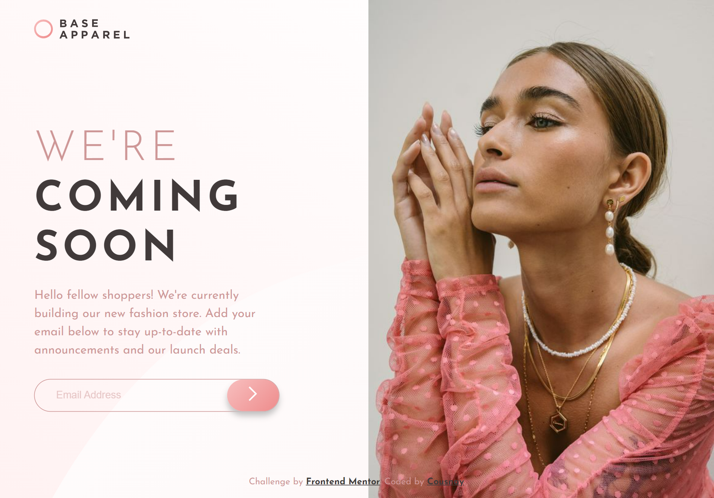

# Frontend Mentor - Base Apparel coming soon page solution

This is a solution to the [Base Apparel coming soon page challenge on Frontend Mentor](https://www.frontendmentor.io/challenges/base-apparel-coming-soon-page-5d46b47f8db8a7063f9331a0). Frontend Mentor challenges help you improve your coding skills by building realistic projects. 

## Table of contents

- [Overview](#overview)
  - [The challenge](#the-challenge)
  - [Screenshot](#screenshot)
- [My process](#my-process)
  - [Built with](#built-with)
  - [What I learned](#what-i-learned)
  - [Continued development](#continued-development)
  - [Useful resources](#useful-resources)
- [Author](#author)


## Overview

### The challenge

Users should be able to:

- View the optimal layout for the site depending on their device's screen size
- See hover states for all interactive elements on the page
- Receive an error message when the `form` is submitted if:
  - The `input` field is empty
  - The email address is not formatted correctly

### Screenshot

#### Mobile 


#### Desktop




## My process

### Built with

- Semantic HTML5 markup
- CSS custom properties
- Flexbox
- CSS Grid
- Mobile-first workflow

### What I learned

While doing this project, I discovered about Regular Expression, which i think has been a very scary topic for me to approach. However, I got the courage to give it a try and allow myself to make mistakes and improve myself while coding.


### Continued development

I am currently not done with regular expressions, looking at different patterns, and case scenarios where the knowledge of regular expressions might be applied.

Additionally, I would like some assistance on my JS, under the first if condition I have some issues, whereby if the pattern is not correct the error keeps being appended each time. I would like some help to only display it once.

```js
 if (userEmail === "" || !verifyEmail(userEmail)) {
        alertIcon.classList.remove('inactive');
        pageMessage.appendChild(alertNofify); // Every time the input fails to match the regex pattern a new alertNoify is generated each time. How can I make it only appear once, and not keep looping.
        formContainer.style.border = '1px solid red';
    } else if (verifyEmail(userEmail)) {
        const name = extractUsername(userEmail);
        const popup = updatePage(name);
        document.body.appendChild(popup);
        page.classList.add('blur');

        const returnButton = document.createElement('button');
        returnButton.textContent = 'Return';
        returnButton.classList.add('btn', 'exit_button');
        returnButton.onclick = () => {
            document.body.removeChild(popup);
            page.classList.remove('blur');
            document.body.removeChild(returnButton);
            input.value = '';
            alertIcon.classList.add('inactive');
            pageMessage.removeChild(alertNofify);
        }
        document.body.appendChild(returnButton);
    }
```

### Useful resources

- [Digital Ocean](https://www.digitalocean.com/community/tutorials/js-regular-expressions-for-regular-people) - This helped me as an introductory material to the regular expression concept. I liked it a lot it is small and understandable.
- [by gskinner](https://regexr.com/) - This is a playground for regular expressions. It's intuitive and a step by step guide to regular expressions.


## Author

- Frontend Mentor - [@yourusername](https://www.frontendmentor.io/profile/yourusername)
- Twitter - [@cousnay](https://twitter.com/Cousnay)

